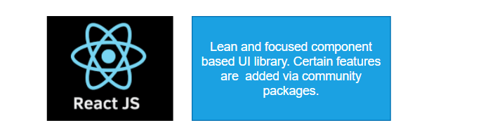
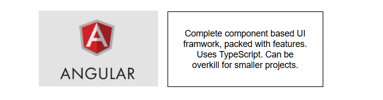
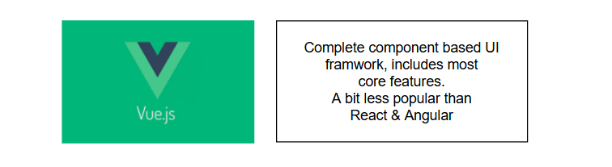

## ◼  React .js 대안 탐색하기 

> 리액트는 컴포넌트 기반의 UI 라이브러리이고, 컴포넌트에 중점을 두고 있다. 
>
> 만약, 이 과정 속에서 자세히 배우게 될 라우팅 같은 기능이 필요하다면 추가적으로 `서드 파티 라이브러리`를 설치해야한다. 

> 앵귤러는 완벽하게 컴포넌트 기반의 UI 프레임워크이고 리액트와 마찬가지로 컴포넌트에 집중한다. 
>
> 리액트보다 더 많은 내장 기능을 가지고 있으며 처음부터 타입스크립트를 수용했다. 
>
> 너무 많은 기능이 내장되어 있기 때문에 작은 프로젝트에는 부담이 될 수 있다. 
>
> 컴포넌트 중심이기는 하지만 앵귤러와 리액트는 약간 다른 방식으로 컴포넌트를 구축한다. 

> 앵귤러 + 리액트 | 뷰 역시 컴포넌트 기반의 UI 프레임워크이고 많은 기능을 포함하고 있지만 기능이 앵귤러보다는 적고 리액트보다는 많다. 
>
> 라우팅같은 핵심 기능을 포함하고 있어서 뷰 역시 커뮤니티 의존성이 낮다. 하지만 앵귤러 사용할 때만큼 과부화 되지 않는다.  