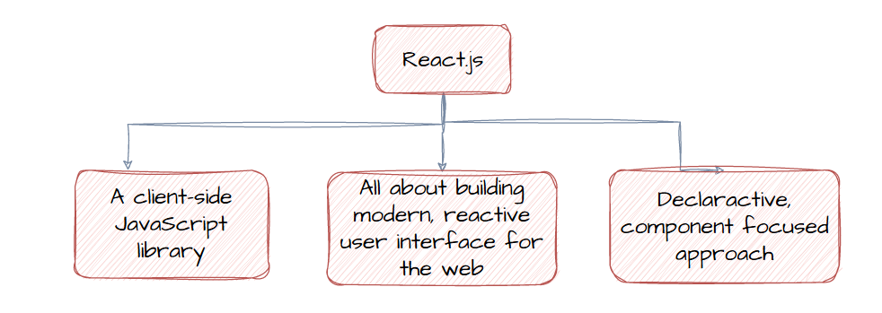

## ◼ 왜 JavaScript 대신 리액트 일까요?

> 리액트는 응용프로그램을 작은 빌딩 블록과 작은 컴포넌트들로 분할하는 것에 관한 것으로, 모든 빌딩 블록, 모든 컴포넌트들은 명확한 태스크들을 갖고 있으며 코드는 유지보수와 관리가 용이하도록 유지된다. 
>
> 리액트에서 라이브러리는 코드를 조합해서 화면에 무언가를 렌더링하는 제일 중요한 작업을 할 것이다.

